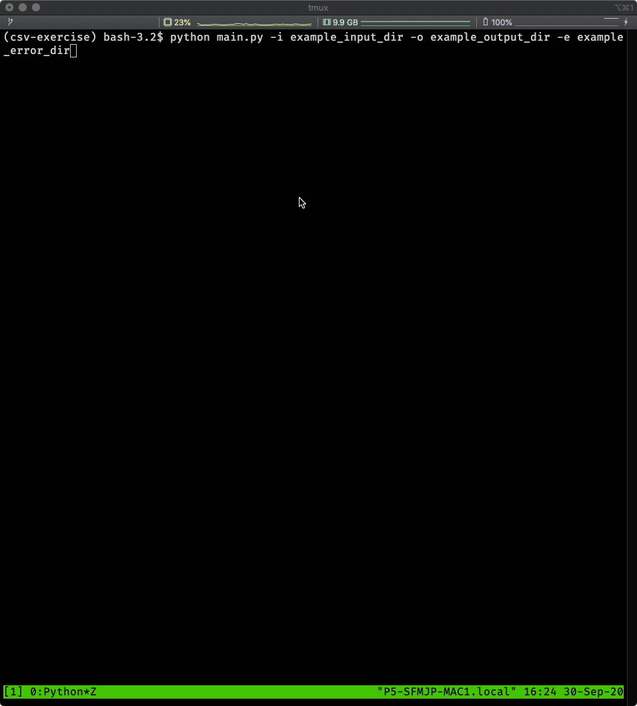

# SCOIR Technical Interview for Back-End Engineers
This repo contains an exercise intended for Back-End Engineers.



## How To

### Requirements

- [python 3.8](https://www.python.org/downloads/release/python-385/)
- [pipenv](https://pypi.org/project/pipenv/)

### Dependencies

- [watchdog](https://pypi.org/project/watchdog/) for triggering actions when files are created

### Running
Runtime Arguments:

```shell script
$ python main.py -h
usage: main.py [-h] [-i INPUT_DIRECTORY] [-o OUTPUT_DIRECTORY] [-e ERROR_DIRECTORY] [-v]

Scoir CSV Exercise: Watch a specified input directory and process CSV Files that are
createdControl-C to quit execution

optional arguments:
  -h, --help            show this help message and exit
  -i INPUT_DIRECTORY, --input-directory INPUT_DIRECTORY
                        Input Directory to watch
  -o OUTPUT_DIRECTORY, --output-directory OUTPUT_DIRECTORY
                        Directory to write our results
  -e ERROR_DIRECTORY, --error-directory ERROR_DIRECTORY
                        Directory to write out errors
  -v, --verbose         Output verbose logs.1
```

```shell script
pipenv install; # INSTALL DEPENDENCIES
pipenv run python main.py -h; # Display runtime parameters
pipenv run python main.py; # EXECUTE PROGRAM WITH DEFAULT PARAMS
```


- [ ] TODO: create gif of execution

### Testing

Tests are written with the built in [unittest](https://docs.python.org/3/library/unittest.html) framework.

```shell script
coverage run --source=src -m unittest discover -s tests;
```

To generate coverage reports:

```shell script
coverage run --source=src -m unittest discover -s tests && coverage report;
```

## Assumptions

1. Data was generated via [mockaroo](https://www.mockaroo.com/a701ae50)
1. The program is intended to be used via Command Line Interface(CLI)
1. The program has been tested on MacOS and Linux(Ubuntu)
1. The program should run until the user exits the program(Control + C)
1. The program should not store processed files between runs
1. The program should create folders if they do do not exist
1. The program should not delete the output directories after a run
1. TODO: All the assumptions